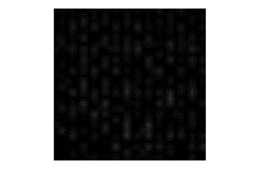
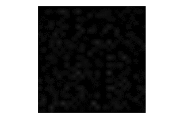

# MNIST-Generation
Generating MNIST handwritten digits with generative adversarial networks.

## Training
Below is the progression of samples from the generator network during training for a fixed point in latent space.  Initially, the generator outputs random noise. As training progresses, the samples become increasingly realistic.
 

## Exploring Latent Space

The domain of our generator function is a hypercube centered around the origin.  We only sample from a small portion of this space during training, so it's interesting to see how our generator function will interpolate for unseen values.  Below are two different random walks.  As we randomly explore the latent space, we run each point through the generator to see the corresponding image.

 