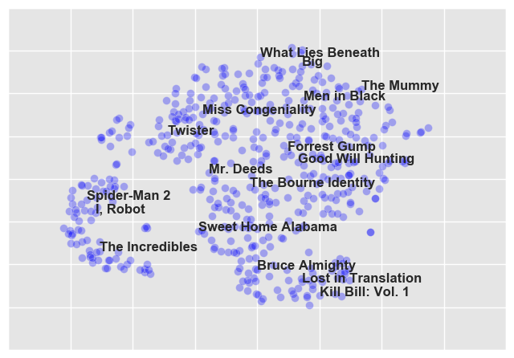
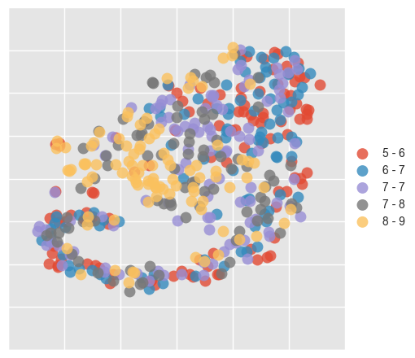
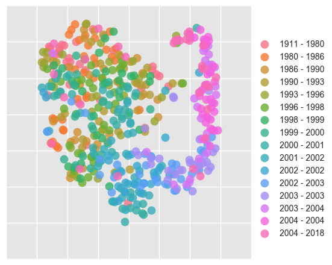
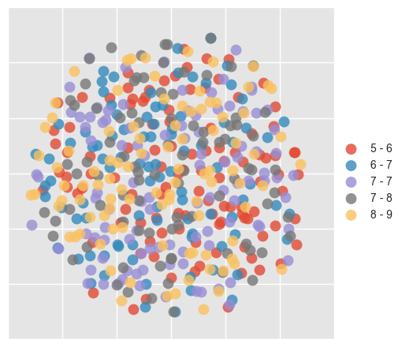

# Movie-Embeddings

Skip-Gram Negative Sampling (SGNS) is a method which uses shallow neural networks to produce low dimension embeddings for sparse inputs.  Similarly, Non-Negative Matrix Factorization (NNMF) is used to produce low rank approximations of a matrix.  In this project, I implement both methods of dimensionality reduction via stochastic gradient descent using the Netflix Prize Dataset.


```python
>>> from movie2vec import Movie2Vec
```

Movie2Vec is an interface similar to gensim's Word2Vec for exploring some interesting properties of embeddings.


```python
>>> SGNS_model = Movie2Vec('SGNS/embeddings/embeddings_50d.txt')
>>> NNMF_model = Movie2Vec('NNMF/embeddings/embeddings_50d.txt')
```

Each movie is represented by a low dimension vector.  For now, we use 50 dimension embeddings.  The vector representation for 'Shrek 2' is shown below.


```python
>>> SGNS_model['Shrek 2']
```


    array([ 0.0298403 ,  0.13338585,  0.06282518, -0.11375999,  0.00343208,
           -0.01387573, -0.00414034, -0.08958468, -0.03241136, -0.01632089,
           -0.18874887,  0.0679372 , -0.05991281,  0.03723855, -0.21139598,
            0.14716135,  0.18735021,  0.05666263, -0.1199352 , -0.02934952,
           -0.10329529,  0.21795151,  0.15346397, -0.06822117,  0.17577928,
           -0.16695569,  0.06894142, -0.12021796, -0.19714595, -0.14082144,
            0.10313168,  0.25778821,  0.26622608,  0.10628814, -0.11001488,
           -0.16270301, -0.14682591,  0.03288676, -0.21612419,  0.2008239 ,
            0.13098554, -0.04551408,  0.29558733, -0.23252119, -0.13954467,
           -0.11039855, -0.02728603, -0.23534918,  0.04242067, -0.09441321])


Using these vectors, we can find the most similar movies to a given movie (using cosine distances between the embedding vectors).  Below are the most similar movies to 'Monsters, Inc'.  Evidently, the SGNS model develops a much more pleasing notion of similarity.


```python
>>> NNMF_model.most_similar('Monsters, Inc.', top_n=8)
```


    [('Monsters, Inc.', 0.99999989888353868),
     ('Short Cuts', 0.55553180130997171),
     ('The Serpent and the Rainbow', 0.49727951472474152),
     ('Disappearing Acts', 0.4723187888378842),
     ("Jackie Chan's Who Am I", 0.46938105285489351),
     ('Dancing at Lughnasa', 0.45514683189939642),
     ('Catch Me If You Can', 0.4499783968325799),
     ('My Family', 0.44941594849280525)]


```python
>>> SGNS_model.most_similar('Monsters, Inc.', top_n=8)
```


    [('Monsters, Inc.', 0.99999994536980852),
     ('Lilo and Stitch', 0.82364214427360483),
     ('Ice Age', 0.80631344910267644),
     ("Harry Potter and the Sorcerer's Stone", 0.78763258479085629),
     ('Lord of the Rings: The Fellowship of the Ring', 0.77804629859726371),
     ('Stuart Little 2', 0.72011284650290697),
     ('Spirit: Stallion of the Cimarron', 0.71908647044364271),
     ("The Emperor's New Groove", 0.71628732877164047)]


As commonly demonstrated by Word2Vec in the context of NLP, we can use the embeddings for analogical reasoning.  For example, 'Spider-Man' : 'Spider-Man 2' :: 'Harry Potter and the Sorcerer's Stone': ?.  Ideally, we'd like the model to have learned a latent representation that has a fixed offset between a movie and it's sequel.  Below is an (admittedly rare) example of where this analogical reasoning actually works.


```python
>>> SGNS_model.complete_analogy("Spider-Man", "Spider-Man 2", "Harry Potter and the Sorcerer's Stone")
```


    ['Harry Potter and the Prisoner of Azkaban']


To get a better idea of how the embeddings are arranged in the 50-dimensional embedding space, we can further reduce the embeddings to a 2-dimensional space so that we can visualize them.  We use t-SNE (t-distributed stochastic neighbor embedding) to attain our 2-dimensional vectors.  Below we view the embeddings produced by the SNGS model.  A few movies in the resulting plot have been annotated.


```python
>>> from tSNE import TSNEViewer
```


```python
>>> SGNS_tsne = TSNEViewer(model=SGNS_model)
>>> SGNS_tsne.plot()
```





It's interesting to see how the structure of the embeddings reveals certain properties of the movies.  Below, we color-code each point in the plot based on the average rating the movie received.


```python
>>> SGNS_tsne.plot('rating')
```





Now we do the same thing, but using the release year of the movie instead.


```python
>>> SGNS_tsne.plot('year')
```





Repeating the same process, but with the embeddings produced by the NNMF model produces less interesting results.  The NNMF embeddings don't seem to contain any sort of structure or patterns that are immediately visible.


```python
>>> NNMF_tsne = TSNEViewer(model=NNMF_model)
>>> NNMF_tsne.plot('rating')
```




