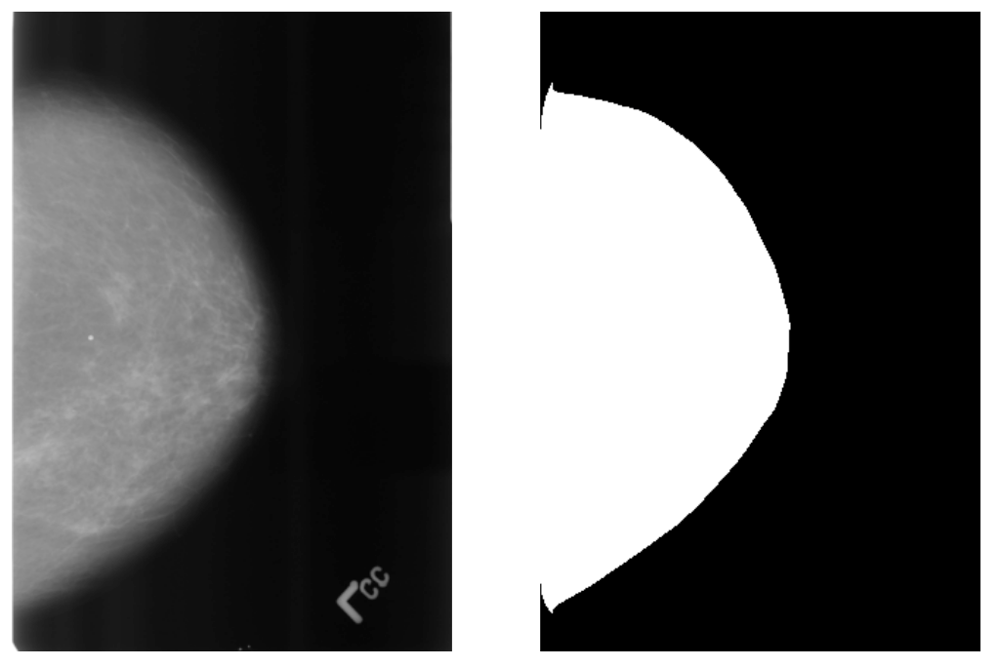
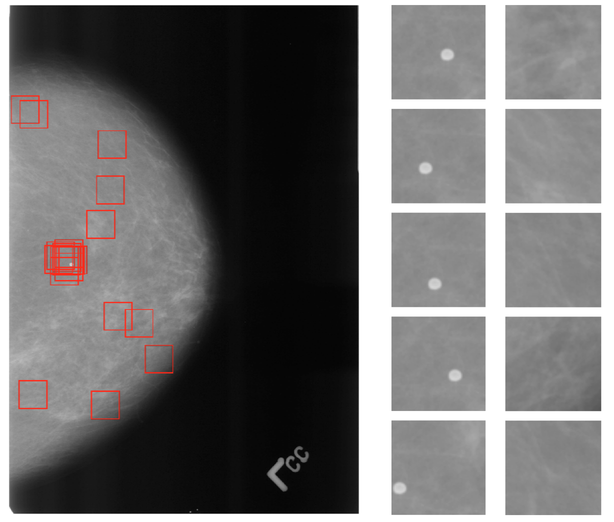
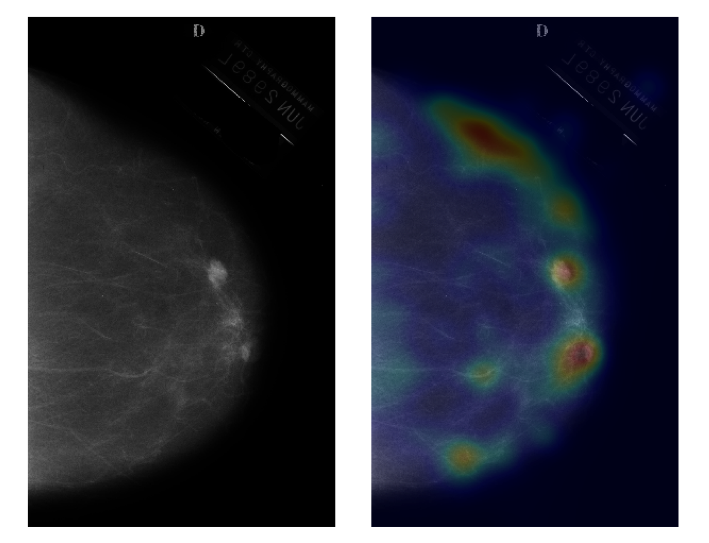

# Tumor-Localization

The goal of this project is to use convolutional networks to identify regions of mammogram images that are at high risk of developing tumors.  A set of a couple thousand mammograms annotated with circles around the tumors were used for training.  We formulate the problem as a regression problem.  For any patch in the image, we need to predict the likelihood that the region contains a tumor.  

## Segmentation
We sample patches from the image randomly.  Since the background of the mammogram is uninformative, we segment the breast from the background so that we can restrict our samples to the portion of the image corresponding to the breast.  The segmentation is shown below.

## Sampling
We use stratified sampling to generate samples from the region corresponding to the breast.  We sample 30 patches of the tumor and 30 samples from elsewhere on the breast.  On the image below, the red boxes show some of the sampled patches.  The left column of images shows some positive samples and the right column shows some negative samples.

## Prediction
We train a convolutional network using the generated samples.  For prediction, we partition a new image into patches and use the network to predict for each patch.  The output is run through a softmax normalization to give a distribution over the pixels in the image, which we then smooth with a gaussian kernel.  An example image and an overlay of the network's smoothed predictions are shown below.

